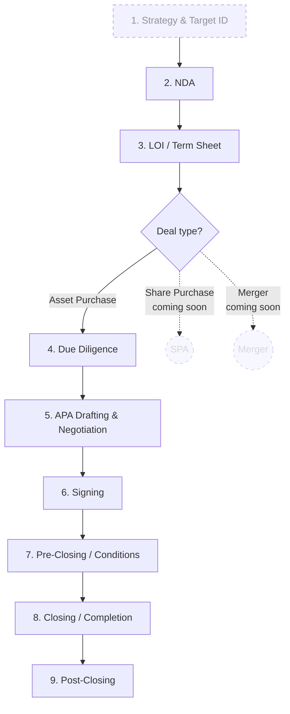

# Architecture

A static, single-page Next.js app that renders an interactive M&A workflow
diagram, with side panels driven by a static JSON file generated from CUAD.

## Tech stack

| Layer | Choice | Why |
|---|---|---|
| Framework | Next.js 15 (App Router) + React 19 + TypeScript | Modern, easy static export, matches user's existing stack |
| Diagram | Mermaid (via `mermaid` npm) | Declarative, easy to extend, handles branching cleanly |
| Styling | Tailwind CSS | Lightweight; no UI library lock-in |
| State | React `useState` / `useReducer`, no global store needed for v1 | Single page, small state surface |
| Data | Static `public/clauses.json` (~ a few hundred KB, well under 1MB) | No backend; deploys anywhere |
| Data extraction | One-off Python script using `datasets` library | Run once locally, commit the JSON output |
| Deployment | Vercel (or `next export` → GitHub Pages) | Zero-config |

## File layout (proposed)

```
learning-MnA/
├── README.md
├── package.json
├── next.config.js                 # output: 'export' for static deploy
├── tsconfig.json
├── tailwind.config.ts
├── postcss.config.js
├── app/
│   ├── layout.tsx                 # root layout, theme, fonts
│   ├── page.tsx                   # main visualization page
│   ├── globals.css
│   └── about/page.tsx             # "what is this / disclaimer / sources"
├── components/
│   ├── WorkflowDiagram.tsx        # renders the Mermaid SVG, handles node clicks
│   ├── StagePanel.tsx             # side panel for the selected stage
│   ├── ClauseCard.tsx             # one clause excerpt (CUAD or hand-authored)
│   ├── DocChecklist.tsx           # per-stage document list
│   ├── DepthToggle.tsx            # Beginner ↔ Practitioner switch
│   ├── GlossaryTooltip.tsx        # hover term → definition popover
│   └── DealTypeSelector.tsx       # APA active, SPA/Merger greyed out
├── lib/
│   ├── workflow.ts                # the 9 stages as typed data (TS objects)
│   ├── glossary.ts                # term → definition map
│   ├── clauses.ts                 # loader + types for clauses.json
│   └── mermaid-spec.ts            # function: stages → mermaid diagram source
├── data/
│   ├── workflow.json              # generated/committed: derived from workflow.ts
│   └── apa-gap-fills.json         # hand-authored APA clauses (from workflow-mapping.md)
├── public/
│   └── clauses.json               # generated by scripts/extract_cuad.py
├── scripts/
│   ├── extract_cuad.py            # pulls CUAD from HF, emits clauses.json
│   ├── requirements.txt           # python deps: datasets, huggingface_hub
│   └── README.md                  # how to run the script
└── docs/
    ├── workflow-mapping.md        # ← copied from this bundle
    └── architecture.md            # ← copied from this bundle (this file)
```

## Data shapes

### `workflow.ts` — typed stage data

```ts
export type StageId =
  | 'strategy'
  | 'nda'
  | 'loi'
  | 'dd'
  | 'apa-drafting'
  | 'signing'
  | 'pre-closing'
  | 'closing'
  | 'post-closing';

export interface Stage {
  id: StageId;
  index: number;            // 1..9
  label: string;            // short label for the diagram node
  isPreProcess?: boolean;   // stage 1 is dashed/muted
  beginnerSummary: string;
  practitionerSummary: string;
  documents: string[];      // checklist items
  cuadCategories: string[]; // names matching keys in clauses.json
  apaGapFills: GapFill[];   // hand-authored
  glossaryTerms: string[];  // term keys for tooltips
}

export interface GapFill {
  title: string;
  description: string;
  exampleWording?: string;  // markdown-rendered
}

export const STAGES: Stage[] = [/* derived from workflow-mapping.md */];
```

### `clauses.json` — generated from CUAD

```json
{
  "Anti-Assignment": {
    "category": "Anti-Assignment",
    "question": "Highlight the parts that discuss anti-assignment provisions...",
    "examples": [
      {
        "contract": "Acme License Agreement (2018)",
        "excerpt": "Neither party may assign this Agreement without the prior written consent of the other party...",
        "source": "CUAD"
      }
    ]
  },
  "Change of Control": { /* ... */ }
}
```

We curate ~3 examples per category (best-quality, varied length, anonymised
where needed). Total file size target: < 500 KB.

### `glossary.ts` — term map

```ts
export const GLOSSARY: Record<string, { term: string; definition: string }> = {
  loi: { term: 'LOI', definition: 'Letter of Intent — a non-binding document...' },
  // ...
};
```

## Component behaviour

### `WorkflowDiagram`

- Renders Mermaid via `mermaid.initialize` + `mermaid.render`.
- Diagram source is generated from `STAGES` so that changing the data updates
  the diagram automatically.
- Click handler on each node sets `selectedStageId` (lifted to page).
- The branching node at LOI uses Mermaid's `subgraph` and styled classes:
  APA path active, SPA/Merger styled with dashed lines and a "coming soon"
  tooltip.

### `StagePanel`

- Receives `selectedStageId` and `depth: 'beginner' | 'practitioner'`.
- Renders: stage title, summary (depth-dependent), `DocChecklist`,
  practitioner-only sections (CUAD `ClauseCard`s, APA gap-fills).
- Glossary terms in the text are wrapped in `GlossaryTooltip`.

### `DealTypeSelector`

- Three buttons: APA (active), SPA (disabled with "coming soon"), Merger
  (disabled). Sits at the top of the page.

## Mermaid diagram source (illustrative)



## CUAD extraction script (one-off)

```python
# scripts/extract_cuad.py
from datasets import load_dataset
import json, re
from collections import defaultdict

# Categories we care about (subset of CUAD's 41)
RELEVANT_CATEGORIES = [
    "Anti-Assignment", "Change of Control", "IP Ownership Assignment",
    "License Grant", "Non-Transferable License", "Source Code Escrow",
    "Audit Rights", "Most Favored Nation", "Minimum Commitment",
    "Volume Restriction", "Affiliate License-Licensor", "Affiliate License-Licensee",
    "Exclusivity", "Governing Law", "Expiration Date", "Effective Date",
    "Parties", "Agreement Date", "Cap On Liability", "Uncapped Liability",
    "Warranty Duration", "Insurance", "Liquidated Damages", "Covenant Not To Sue",
    "Third Party Beneficiary", "Non-Compete", "No-Solicit Of Customers",
    "No-Solicit Of Employees", "Non-Disparagement", "Post-Termination Services",
    "Competitive Restriction Exception",
]

EXAMPLES_PER_CATEGORY = 3

ds = load_dataset("theatticusproject/cuad-qa", split="train")

buckets = defaultdict(list)
for row in ds:
    # CUAD encodes the category in the question; map it back
    for cat in RELEVANT_CATEGORIES:
        if cat.lower() in row["question"].lower() and row["answers"]["text"]:
            excerpt = row["answers"]["text"][0].strip()
            if 80 <= len(excerpt) <= 800:  # readable length
                buckets[cat].append({
                    "contract": row["title"],
                    "excerpt": excerpt,
                    "question": row["question"],
                    "source": "CUAD",
                })
            break

# Pick the top N per category (could rank by length, by contract diversity, etc.)
output = {}
for cat in RELEVANT_CATEGORIES:
    examples = buckets[cat][:EXAMPLES_PER_CATEGORY]
    output[cat] = {
        "category": cat,
        "examples": examples,
    }

with open("public/clauses.json", "w") as f:
    json.dump(output, f, indent=2)

print(f"Wrote {sum(len(v['examples']) for v in output.values())} examples "
      f"across {len(output)} categories")
```

## Deployment

- `next.config.js`: `output: 'export'`
- `npm run build` → `out/` directory
- Deploy `out/` to Vercel, GitHub Pages, or any static host.

## Build vertical slice first

When implementation starts, the recommended order is:

1. Scaffold Next.js app (next CLI), Tailwind, base layout
2. Hard-code one stage (e.g., Stage 4 — Due Diligence) end-to-end:
   - Stage data in `lib/workflow.ts`
   - Clauses in a tiny stub `clauses.json` (don't run extraction yet)
   - `WorkflowDiagram` showing only that node
   - `StagePanel` rendering everything
   - Depth toggle, glossary tooltip
3. Once that vertical slice works, fan out to all 9 stages
4. Run the CUAD extraction script to populate the real `clauses.json`
5. Polish: dark mode, mobile layout, about page, disclaimers
